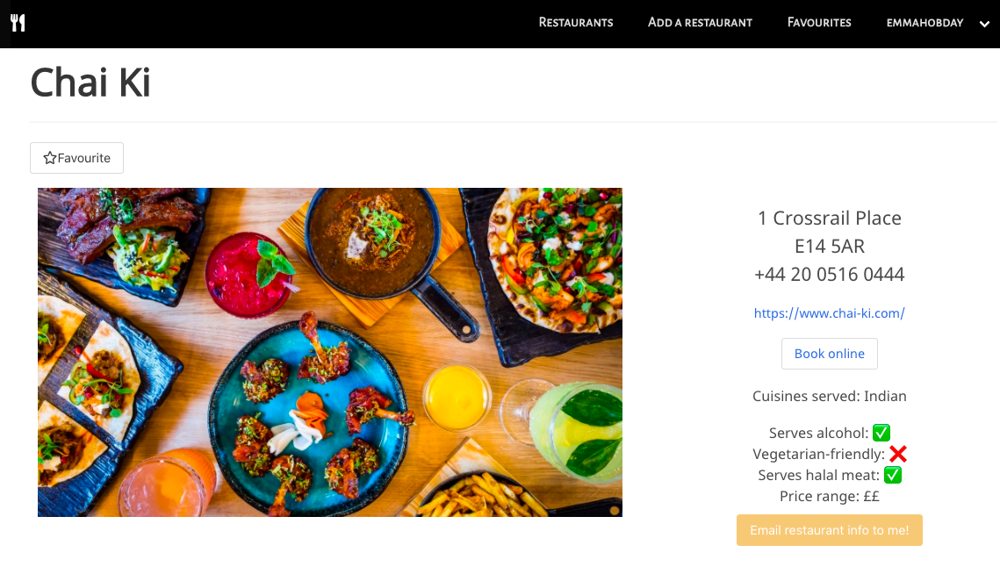

### General Assembly, Software Engineering Immersive

# project-3

## Food For Thought
by [Emma Hobday](https://emmahobday.github.io/), [Denise Cheung](https://denisecheung3.github.io/), [Ben Harris](https://benharris8.github.io/) and [Subash Limbu](https://subashlimbu.github.io/).

Food for Thought is an app which helps users discover new, exciting restaurants in London. 


We worked as a team of four on this project. We came up with the plan for the design and functionality of the app together. Each day we held a team stand-up to discuss the project. We each worked on some features individually, and also did some pair programming. We all collaborated throughout each day with problem-solving and debugging each others' code.

We built a MongoDB database of restaurant information, and served this data using Express. We used JWT Auth to allow users to create accounts, log-in and change their password. On the front-end, built with React, users can browse, search and filter restaurants. Users can add restaurants to their 'favourites' list, email restaurant information to themselves, and add new restaurants to the database.

## Table of contents

* [Brief](#brief) 
* [Technology used](#tech) 
* [Approach](#approach) 
	* [Browse restaurants](#browse)
		* [Backend](#backend)
		* [Frontend](#frontend)
	* [Email restaurant information to me](#email) 
	* [Maps](#maps)	
	* [Random restaurant](#random)	
	* [Search](#search)
	* [User authentication](#auth)
		* [Register](#register)
		* [Login](#login)		
		* [Logout](#logout)		
		* [Change Password](#changepw)
	* [NavBar](#navbar)
	* [Additional features](#additional)
		* 	[Add a restaurant](#addrest)
		* 	[Favourites](#addrest)
	*  [Challenges](#challenges)
	*  [Lessons learned](#learning)
	*  [Future development ideas](#future)

<a name="brief"></a>
## Brief
* Work in a team, using git to code collaboratively.
* Build a full-stack application by making your own backend and your own front-end
* Use an Express API to serve your data from a Mongo database
* Consume your API with a separate front-end built with React
* Be a complete product which most likely means multiple relationships and CRUD functionality for at least a couple of models

<a name="tech"></a>
## Technologies Used
* CSS
* HTML
* JavaScript (ES6)
* React.js
* Node.js
* Express
* Mocha and Chai
* React Map GL (Mapbox)
* Postcode.io API
* Node MailJet
* Mongo and Mongoose
* Git and GitHub
* Bulma
* Google Fonts

<a name="approach"></a>
## Approach
<a name="browse"></a>
## Browse restaurants
<a name="backend"></a>
### Backend

Our first step was to create a restaurant Model, which specified the fields that each restaurant entry should have. We mapped out what we'd like the site to contain and thought carefully about precisely what data we'd need to create the app we envisioned. We created this schema:

```
const restaurantSchema = mongoose.Schema({
  name: { type: String, required: true },
  link: { type: String, required: false },
  address: { type: String, required: true },
  postcode: { type: String, required: true },
  telephone: { type: String, required: true },
  bookingLink: { type: String, required: false },
  cuisine: { type: Array, required: true },
  serveAlcohol: { type: Boolean, required: false },
  veggieFriendly: { type: Boolean, required: false },
  halalFriendly: { type: Boolean, required: false },
  priceRange: { type: Number, required: true },
  user: { type: mongoose.Schema.ObjectId, ref: 'User', required: true },
  comments: [commentSchema],
  image: { type: String, required: false },
  imageGallery: { type: Array, required: false }
});
```

We then created a `seed.js` file which contained all the restaurant data. We populated this with information we'd gathered ourselves, taking two cuisines each and finding ten restaurants for each.

In our `restaurantController.js` file, we created functions to retrieve all restaurants (`index()`) or a single restaurant (`viewARestaurant()`) from the database:

```
const Restaurant = require('../models/restaurant')

function index(req, res) {
  Restaurant
    .find()
    .then(restaurants => {
      res.status(200).send(restaurants)
    })
    .catch(error => {
      console.log(error)
    })
}

function viewARestaurant(req, res) {
  const id = req.params.id
  Restaurant
    .findById(id)
    .then(restaurant => {
      res.send(restaurant)
    })
}
```

In our `router.js` file, we wrote GET routes for these requests:

```
router.route('/restaurants')
  .get(restaurantController.index)
```
```
router.route('/restaurant/:id')
  .get(restaurantController.viewARestaurant)
```
<a name="frontend"></a>
### Frontend

### View all restaurants
When the 'restaurants' page loads, a request is made to the backend for the all-restaurant data, using the life cycle method componentDidMount():

```
  componentDidMount() {
    axios.get('/api/restaurants')
      .then((resp) => this.setState({
        restaurants: resp.data,
        filteredRestaurants: resp.data
      }))
      .catch(err => console.error(err))
  }
```
Once the data is returned, it is rendered on the page. We used a loader-spinner to render on the page if the data takes a while to be returned.

`    if (!this.state.restaurants) return <LoaderSpinner />`

We then mapped over the data and used Bulma Cards for each restaurant.


On hover, the card displays the name and address of the restaurant.

```
.card:hover .resImage {
  opacity: 0.7;
}

.card:hover .card-content {
  opacity: 1;
}
```

### Single Restaurant information

When a user selects a particular restaurant, they are taken to the page ``to={`/restaurant/${restaurant._id}`}``.

In our frontend `app.js`, the following route is in our `BrowserRouter`:

`<CustomRoute path="/restaurant/:id" component={SingleRestaurant} />`

This means that any path of that form will load the SingleRestaurant component, and the id will be accessible through props. Thus, when the page loads, the SingleRestaurant component can make a request to the API in the following way:

```
  componentDidMount() {
    const id = this.props.match.params.id
    axios.get(`/api/restaurant/${id}`)
      .then(resp => {
        this.setState({ restaurant: resp.data })
      })
      .catch(err => console.error(err))
  }
```
This component renders all the information about that restaurant on the page:



Using the ❌ and ✅ makes the information easy for the reader to take in quickly. These fields return from the API as a boolean, so the following code created the emojis:

```
  crossTick(boolean) {
    if (boolean === true) {
      return '✅'
    } else {
      return '❌'
    }
  }
```
<a name="email"></a>
### Email restaurant information to me

We included a feature whereby users can email the information about a restaurant to themselves. We did this using MailJet.

The button, on click, calls the function `handleEmailRestoInfo()`, which makes the following GET request:

```
axios.get(`/api/restaurant/${id}/email`, { headers: { Authorization: `Bearer ${auth.getToken()}` } })
```

On the backend, in our `router.js` we created the necessary route:

```
router.route('/restaurant/:id/email')
  .get(secureRoute, restaurantController.emailRestaurantInfo)
```

I'll explain how we used `secureRoute` in the User Authentication section - as this feature is only available to logged in users.

We used MailJet to create and send the email. We created an account to get the necessary API keys and stored them in the `.env` file. The user's email is retrieved from their user profile using ``"Email": `${currentUser.email}`,
                  "Name": `${currentUser.username}`
                }``

The function to send the email with MailJet is:

```
function emailRestaurantInfo(req, res) {
  const currentUser = req.currentUser
  const mailjet = require('node-mailjet')
    .connect(process.env.MJ_API_KEY1, process.env.MJ_API_KEY2)
  Restaurant
    .findById(req.params.id)
    .then(restaurant => {
      const veggieFriendly = restaurant.veggieFriendly ? '✅' : '❌'
      const serveAlcohol = restaurant.serveAlcohol ? '✅' : '❌'
      const halalFriendly = restaurant.serveAlcohol ? '✅' : '❌'
      const priceRange = '£'.repeat(restaurant.priceRange)
      const request = mailjet
        .post("send", { 'version': 'v3.1' })
        .request({
          "Messages": [
            {
              "From": {
                "Email": "foodforthought0987@gmail.com",
                "Name": "FoodForThought"
              },
              "To": [
                {
                  "Email": `${currentUser.email}`,
                  "Name": `${currentUser.username}`
                }
              ],
              "Subject": "Restaurant you are interested on FoodForThought",
              "TextPart": "Email from FoodForThought",
              "HTMLPart": `<h3> Thank you for using FoodForThought. Please find the restaurant information as requested. </h3> <br />  <br /> Name of restaurant: ${restaurant.name} <br /> Cuisine: ${restaurant.cuisine[0]} <br /> Restaurant link: ${restaurant.link} <br /> Address: ${restaurant.address} <br /> Postcode: ${restaurant.postcode} <br /> Telephone: ${restaurant.telephone} <br /> Veggie friendly: ${veggieFriendly} <br /> Serves alcohol: ${serveAlcohol} <br /> Halal friendly: ${halalFriendly} <br /> Price range: ${priceRange}`
            }
          ]
        })
      request
        .then(() => {
          res.status(200).send(
            'Email sent successfully!'
          )
        })
        .catch((err) => {
          res.status(500).send(
            'Email not sent, please contact administrator.'
          )
        })
    })
}
```

The user then receives an email like this:


Back on the front-end, once the the user has clicked on the 'email restaurant information to me' button, a small confirmation message appears on-screen:


This message is returned from the API - if there is an error, the error message is set in state and will be displayed instead.

<a name="maps"></a>
### Maps
The single restaurant page also displays a map showing the location of the restaurant. We created this using MapBox and ReactMapGL. 


We created the code for this in a separate component, sending the postcode of the restaurant currently being displayed through as props.

`<Map
  postcode={postcode}
/>`

We used ReactMapGL, a React-friendly library which displays maps. This needs the latitude and longitude of the location, so we used another API, `postcodes.io`, to convert the postcode of the restaurant into this format:

```
state = {
    viewport: {
      width: 400,
      height: 400,
      latitude: null,
      longitude: null,
      zoom: 16
    }
  }
  
componentDidMount() {
    axios.get(`https://api.postcodes.io/postcodes/${this.props.postcode}`)
      .then(resp => {
        const viewport = { ...this.state.viewport, longitude: resp.data.result.longitude, latitude: resp.data.result.latitude }
        this.setState({ viewport })
      })
  }
```

The fields defined in state are those needed by ReactMapGL to display the map. The precise location is marked using Marker. 

`import ReactMapGL, { Marker } from 'react-map-gl'`

```
<ReactMapGL
        mapStyle='mapbox://styles/mapbox/streets-v11'
        mapboxApiAccessToken='pk.eyJ1IjoiZGVuaXNlY2hldW5nMyIsImEiOiJjazg1dm8zbXAwMHRjM2ZuNDRwYzBsc2dyIn0.f3j4m4DkK3RYG0vAVhE8_Q'
        {...this.state.viewport}
        onViewportChange={(viewport) => this.setState({ viewport })}>
        <Marker latitude={this.state.viewport.latitude} longitude={this.state.viewport.longitude} offsetLeft={-20} offsetTop={-10}>
          
        </Marker>
      </ReactMapGL>
```

###Comments
Logged-in users can leave comments on a restaurant page, and those comments can be upvoted and downvoted. 

COME BACK TO THIS

<a name="random"></a>
### View a random restaurant

On our front page, we have a small feature enabling users to view details of a random restaurant upon clicking a button - perfect for the indecisive!

We did this by setting an onClick event on the button, which calls the function `getRandomRestaurant()`.

We had the choice of generating the random restaurant ID on the front-end or back-end, and decided to do it on the backend. One reason for this is that we need to know how many restaurants are in the database to know the parameters for the random number; since users can add restaurants to the database, this number will be constantly changing. We'd need to make a request to the backend to find out how many restaurants there currently are, so since we're communicating with the backend already, it seems most elegant to simply return the random restaurant id at this point.

This meant we needed to create a new 'random' route in our `router.js` for the path *'/random'* and a function in our `restaurantController.js`:

```
function getRandomRestaurant(req, res) {
  Restaurant
    .find()
    .then(arrayofAllRestaurants => {
      const randomNumber = Math.floor((Math.random() * arrayofAllRestaurants.length)) 
      return res.send(arrayofAllRestaurants[randomNumber]) 
    })
    .catch(err => res.send({ error: err }))
}
```
This generates a random number between 0 and one less than the number of restaurants in the database. The function then returns just the restaurant data for the restaurant at that position in the array of all restaurants.

On the front end, once this data is returned, the function `getRandomRestaurant()` then navigates to the page displaying that restaurant's details:

```
      .then((resp) => {
        randomRestaurantId = resp.data._id
        return randomRestaurantId
      })
      .then((randomRestaurantId) => {
        props.history.push(`/restaurant/${randomRestaurantId}`)
      })
```

<a name="search"></a>
### Search and filter


The `Restaurants.js` component also includes a searchbar, allowing the user to search for a restaurant by name; and a filter, allowing the user to filter restaurants by cuisine type. These two features also work together, allowing for a more precise search.

We achieved this by including two functions,` handleDropdown()` and `handleSearch()`. Each of these functions takes account of the state of the other to allow them to work together.

In our searchbar function, a variable stored in the state called `searchText` is set to the searchbar text every time a keypress is detected. We set this immediately as lower case, to avoid any casing issues:

```
this.setState({ searchText: event.target.value.toLowerCase() }) 
```

We then check whether the dropdown option has been selected - this is also set in state when selected - and if there is no dropdown option selected, the restaurants are filtered by checking whether the restaurant name includes the searchText string:

```
if (!this.state.dropDownOption) { 
      const onlySearched = this.state.restaurants.filter(restaurant => {
        return restaurant.name.toLowerCase().includes(event.target.value.toLowerCase())
      })
      this.setState({ filteredRestaurants: onlySearched })
    } 
```

Both the restaurant name and the searchText string are converted to lower case to avoid issues with case. If the dropdown has been selected, then the array filter method will return restaurants whose cuisine array includes the dropdown selected and whose name includes the searchText string.

```
else {  
      const bothUsed = this.state.restaurants.filter(restaurant => {
        return (restaurant.cuisine.includes(this.state.dropDownOption) && restaurant.name.toLowerCase().includes(event.target.value))
      })
      this.setState({ filteredRestaurants: bothUsed })
    }
```

The handleDropdown function works similarly: the option selected is set in state, and if the searchbar does not contain any text, then the restaurants are filtered by the cuisine type selected; if the searchbar does contain text, then the function returns only those restaurants whose cuisine type array includes the dropdown option and whose name includes the searchText string.

We also ensured that if the dropdown is set to 'Search All', all restaurants are displayed:

```
if (event.target.value === 'Search All') {
      if (!this.state.searchText) {  
        this.setState({ filteredRestaurants: this.state.restaurants })
      } else { 
        const onlySearched = this.state.restaurants.filter(restaurant => {
          return restaurant.name.toLowerCase().includes(this.state.searchText.toLowerCase())
        })
        this.setState({ filteredRestaurants: onlySearched })
      }
    }
```

<a name="auth"></a>
## User Authentication
<a name="register"></a>
## Register


### Backend
We created a User model with the following fields:

```
const schema = new mongoose.Schema({
  username: { type: String, required: [true, 'please enter a username'], unique: true },
  email: {
    type: String,
    required: [true, 'please enter an email address'],
    minLength: 8,
    unique: true,
    validate: [isEmail, 'please enter a valid email address']
  },
  password: {
    type: String,
    required: [true, 'please enter a password'],
    hide: true
  },
  favourites: [{ type: mongoose.Schema.ObjectId, ref: 'Restaurant', required: false }]
})
```

The validation `isEmail`is a subset of the library `validator.js`, which is we imported - `const { isEmail } = require('validator')` . 

Our password validation is done separately - it wouldn't work in this schema because we are hashing the passwords, and adding validation at this point would run the hashed password against validation checks, which wouldn't work.

When a user registers, they need to confirm their password. This field shouldn't be included on the User model because we don't want to save it as a separate field - it's purely there to check that the password matches it.

```
schema.
  virtual('passwordConfirmation')
  .set(function setPasswordConfirmation(passwordConfirmation) {
    this._passwordConfirmation = passwordConfirmation
  })
```

We used a virtual attribute because we don't want this to be persisted to the database.

We then check the password is valid , using Mongoose Custom Validators, and sufficiently complex, using Joi Password complexity:

```
const { isValidPassword } = require('mongoose-custom-validators') //to validate password 
const passwordComplexity = require('joi-password-complexity')
```

```
schema
  .pre('validate', function checkPassword(next) {
    if (this.isModified('password')) {
      const validationResult = passwordComplexity().validate(this.password)
      if (validationResult.error) {
        this.invalidate('password', 'Password must be at least 8 characters long, contain at least 1 uppercase letter, 1 lowercase letter, 1 number and 1 special character.')
      }
      if (this._passwordConfirmation !== this.password) {
        this.invalidate('passwordConfirmation', 'Passwords should match.')
      }
    }
    next()
  })
```

Our final step, if the password passes these checks, is to encrypt it using `bcrypt`.

```
schema
  .pre('save', function hashPassword(next) {
    if (this.isModified('password')) { 
      this.password = bcrypt.hashSync(this.password, bcrypt.genSaltSync()) 
    }
    next()
  })
```

We then wrote a route in our `router.js`:

```
router.route('/register')
  .post(userController.register)
```

And a `register()` function in the `userController.js`:

```
function register(req, res) {
  User
    .create(req.body)
    .then(user => {
      res.status(201).send(user)
    })
    .catch(error => {
      console.log(error)
      res.status(401).send(error)
    })
}
```


### Frontend

To register, users complete a form with all fields required by our User model (email, username, password) and password confirmation). Our handleChange function updates this.state.data with each keystroke, using the same logic as the searchbar, and our handleSubmit function posts the data to our API endpoint.

If the API returns an error - for example, if the password and passwordConfirmation do not match - the error is set in state, and the error message is rendered onto the page so the user can correct their information and resubmit.


This means the text only appears on the page if `errors.passwordConfirmation` (for example) exists - if no errors, it will no render the `<small/>` element.
`{errors.passwordConfirmation && <small className="help is-danger"> {errors.passwordConfirmation.message} </small>}`

<a name="login"></a>
## Log In
### Backend

Our login function in our `userController.js` checks that the submitted password matches the password in the database. Because the password has been encrypted, this requires us to use the function `validatePassword()` from the User model:

```
schema.methods.validatePassword = function validatePassword(password) {
  return bcrypt.compareSync(password, this.password)
}
```
A status 401 is returned if the password fails the validation check. Otherwise, a token is created and sent back with the response using JSON Web Token (jwt). We used the library jsonwebtoken to do this:

```
function login(req, res) {
  User
    .findOne({ email: req.body.email })
    .then(user => {
      if (!user || !user.validatePassword(req.body.password)) {
        return res.status(401).send({ message: 'Unauthorized' })
      }
      const token = jwt.sign({ sub: user._id }, secret, { expiresIn: '6h' })
      res.status(202).send({ message: `${user.username}`, token })
    })
    .catch(error => res.send({ errors: error.errors }))
}
```

### Frontend

Our login page has a form to be completed. As with the Register component, the data is set in state as the user types, using a `handleChange()` function.

When the form is submitted, a POST request containing the data is sent using axios to our API endpoint. 

```
handleSubmit(event) {
    event.preventDefault()
    axios.post('/api/login',
      this.state.data)
      .then(response => {
        const token = response.data.token
        const name = response.data.message
        auth.setToken(token)
        auth.setName(name)
        this.props.history.push('/')
      })
      .catch(error => this.setState({ error: error.response.data.message }))
  }
```

As we've just seen, if the request is successful, the response will includes the JSON Web Token which is set in local storage using the setToken function in the auth.js file. The user's name is also set so that it can be displayed in the navbar.


`function setToken(token) { localStorage.setItem('token', token) }`

<a name="logout"></a>
### Log Out
Once logged in, the navbar will display a 'logout' option in a dropdown beneath the username. On click, this runs our logout function in our auth file, which removes the Bearer token from local storage. This means that the user will no longer be able to access any secure routes, as these require a token.

`function logout() { localStorage.removeItem('token') }`

ADD MORE HERE
issue with token expiring but it still looks like you're logged n at the front end, because there is a token (this is what is checked), it's just not valid any more!


<a name="changepw"></a>
### Changing your password
Logged-in users have the ability to change their password. This is done by sending a PUT request to our API profile endpoint, including the Bearer token in the request headers.

```
this.state = {
      data: {
        oldPassword: '',
        newPassword: '',
        passwordConfirmation: ''
      }
```

```         
handleSubmit(event) {
    event.preventDefault()
    axios.put('/api/profile',
      this.state.data,
      { headers: { Authorization: `Bearer ${auth.getToken()}` } })
      .then((res) => {
        console.log(res)
        if (res.status === 200) {
          return this.props.history.push('/profile')
        }
      })
      .catch(error => {
        this.setState({ errors: error.response.data })
        console.log('line 42', error.response.data)
      })
  }
```

Our changePassword function in the `userController.js` then finds the user by id. The request includes the user's old password, and the function first checks that this password is valid using the validatePassword function, and returns a 401 status if it is not.

If the old password is valid, the newPassword and passwordConfirmation from the request are set and saved. The User schema includes validation checks on the password, checking that it is suitably complex and that the confirmation matches the password. If there is an error, this is returned in the response. Otherwise, a 200 status is sent.

```
function changePassword(req, res) {
  const user = req.currentUser._id

  User
    .findById(user)
    .then(user => {
      return user
    })
    .then(user => {
      if (!user.validatePassword(req.body.oldPassword)) {
        return res.status(401).send({ passwordValidation: { message: 'Wrong password' } })
      }
      user.set({ password: req.body.newPassword, passwordConfirmation: req.body.passwordConfirmation })
      return user.save(function (error, user) {
        if (error) {
          return res.status(401).send(error.errors)
        }
        return res.sendStatus(200)
      })
    })
}
```

The most challenging aspect of this was handling errors. In our userController, the validation checks are done through the User schema rather than directly in the changePassword function, so we had to ensure that the errors were returned to the front-end such that they could be easily read.

As with Register and Login, our front-end ChangePassword component displays any error messages returned from the back-end so the user can amend their information. If the status 200 is returned, the user is redirected back to their profile page.


The fields in the 'Change Password' form have the added function of being toggle-able between password and text (hidden and visible). We used the 'visibility' icon from material-icons at the end of each input field, and wrapped these two items in a bordered div. We set an onClick event on this icon which calls a function called toggleVisibility, which switches the value of the variable 'hidden' between true and false. The 'type' field of the input field is defined using a ternary operator based on the value of the 'hidden' variable.

```
  toggleVisibility(event) {
    event.preventDefault()
    this.setState({ hidden: !this.state.hidden })
  }
```

```
      <div className="control include-eye">
        <input
          onChange={(event) => handleChange(event)}
          type={this.state.hidden ? 'password' : 'text'}
          name={name}
          className="input change"
        />
        <span className="material-icons eye current" onClick={() => {
          this.toggleVisibility(event)
        }}>visibility</span>
      </div>
```

In order to allow each field to have its own state, and avoid toggling all fields when one icon is clicked, I pulled the code for PasswordField out into its own component with its own state.

<a name="navbar"></a>
## NavBar
We used a Bulma navbar component to format our navigation bar. 

We wanted our navbar to contain different links, depending upon on whether a user is logged in or not. We achieved this by defining a variable 'isLoggedIn', which calls a function in our auth file that returns a boolean; we then, in our render, ensured that these elements only render if the 'isLoggedIn' condition is met, like so:

```
function isLoggedIn() { 
return !!localStorage.getItem('token') 
}
```

```
{isLoggedIn && <div className="navbar-item"> 
<Link className="navbar-edited" to="/restaurant/new">Add a restaurant</Link> 
</div>}
```

We used a navbar-burger to create a collapsible mobile-friendly display. By setting a variable in state called navMobileOpen, set initially as false, we could set display condition and toggle this variable to change the display.

```
this.state = { 
	navMobileOpen: false 
	}
```

```
            <a
              role="button"
              className={`navbar-burger burger ${this.state.navMobileOpen ? 'is-active' : ''}`}
              aria-label="menu"
              aria-expanded="false"
              onClick={() => this.setState({ navMobileOpen: !this.state.navMobileOpen })}
            >
```


We also added a condition in `componentDidUpdate()` that checks whether a new page has been navigated to; if it has, navMobileOpen is set to false, meaning the navbar is displayed.

```
componentDidUpdate(prevProps) {
    if (this.props.location.pathname !== prevProps.location.pathname) {
      this.setState({ navMobileOpen: false })
    }
  }
```

When styling the navbar, we used much of the default Bulma styling, although we wanted to make our own style decisions on particular elements. While the majority of this was trivial to do, some elements took more careful consideration. For example, to prevent the link to the current page from automatically highlighting white with blue text, we removed the bulma class 'navbar-item' and replaced it with 'navbar-edited', and ensured that any desirable default styling was recreated in our personalised class.

<a name="additional"></a>
## Additional features

While anyone can view restaurant information on our site, logged-in users have access to more advanced functionality, including marking favourites, adding new restaurants, and leaving comments.

<a name="addrest"></a>
### Adding a restaurant
Within our secureRoute paths, we included a component to allow logged-in users to add a restaurant to the database.
 
On the front-end, we have a classical component which includes all the keys from the restaurant schema in this.state. The page renders a form (stored as its own functional component), with appropriate inputs for all the data types. 

The`handleChange()` function sets this.state.data with the current input as the user types into each field (as in previous components), and the handleSubmit fuction sends a POST request using axios to our API. As this is a secure route, the Bearer token is included in the headers. The user is then redirected to their newly-created restaurant page.

In our backend, we included this route in our router.js:

```
router.route('/restaurants')
  .post(secureRoute, restaurantController.createNewRestaurant)
```

Within our restaurantController.js file, we wrote a function `createNewRestaurant()`, which identifies the current user, then creates a restaurant using the request body data, and then if successful, returns a status code 201.

```
function createNewRestaurant(req, res) {
  req.body.user = req.currentUser
  console.log(req.body)
  Restaurant
    .create(req.body)
    .then(restaurant => {
      res.status(201).send(restaurant)
    })
}
```
<a name="favourites"></a>
### Favourites

On the front-end, logged-in users can click on the 'favourite' button on a single restaurant's page to add a restaurant to their favourites. Clicking it again removes it from favourites. This is made visually clear to the user by filling in the star when currently a favourite:


The favourite button is a separate component within the 'SingleRestaurant' component:

`<FavouriteButton restaurantId={id} isFavourited={this.state.isFavourited} />`

When it initially loads, the component checks whether this restaurant is favourited by this user by sending an API request, and sets this as a boolean in state. The restaurant ID is accessed through props:

```
  componentDidMount() {
    const isLoggedIn = auth.isLoggedIn()
    isLoggedIn && axios.get('/api/profile',
      { headers: { Authorization: `Bearer ${auth.getToken()}` } }
    )
      .then(resp => {
        const favedRestoArray = resp.data.favourites
        if (favedRestoArray.includes(this.props.restaurantId)) {
          this.setState({ isFavourited: true })
        } else {
          this.setState({ isFavourited: false })
        }
      })
  }
```

The page renders the button (filled-in star if favourited, empty star if not) according to this:

```
  render() {
    return <button className="button is-normal" onClick={(event) => this.handleFavouriteButton(event)}>
      <FontAwesomeIcon icon={this.state.isFavourited ? faStar : faStarEmpty} />
      {'Favourite'}
    </button>
  }
```

Now, when the button is clicked, the function `handleFavouriteButton()` is called. This function checks whether the restaurant is currently favourited, then makes a PUT request to either favourite or unfavourite it:

```
    if (!this.state.isFavourited) {
      axios.put('/api/restaurant/favourite',
        { restaurantId },
        { headers: { Authorization: `Bearer ${auth.getToken()}` } })
        .then(() => this.setState({ isFavourited: true }))
        .catch(err => console.log(err))
    } else {
      axios.put('/api/restaurant/unfavourite',
        { restaurantId },
        { headers: { Authorization: `Bearer ${auth.getToken()}` } })
        .then(() => this.setState({ isFavourited: false }))
        .catch(err => console.log(err))
    }
```

This updates the state `isFavourited` so will update what is seen on the page.

On the backend, the User schema has a field `favourites: [{ type: mongoose.Schema.ObjectId, ref: 'Restaurant', required: false }]`. This is an array that contains restaurantIds with a reference relationship to the Restaurant model. 

We wrote two routes in the `router.js` and two functions in our `userController.js`: favourite and unfavourite add/remove restaurants to this field.

The function `favourite()` adds the restaurantId to the array field 'favourites' on the current user in MongoDB, and sends a status code 200 back. The unfavourite function is very similar, but removes the restaurant from the array using `user.favourites.pull(req.body.restaurantId)`.

```
function favourite(req, res) {
  const user = req.currentUser
  User
    .findOne(user)
    .then(user => {
      user.favourites.push(req.body.restaurantId) 
      return user.save()
    })
    .then((user) => {
      res.status(200).send({ message: 'added restaurant to user favourites field/array' })
    })
    .catch(error => res.send({ errors: error.errors }))
}

```
A logged-in user can view their favourite restaurants through a link on the navbar:


This component makes a GET request to the **/favourites** route of our API and sets the returned array in state. The component maps over this array when it renders the page and displays the restaurants using Bulma cards, just as the main Restaurants component does. If a user has not yet favourited any results, a message is displayed instead: `    if (!this.state.favouritedRestos) return 'Favourite some restaurants!'
`
On the backend, a GET request to the **/favourites** route calls the function `getFavourites()` in the `userController.js`. 

```
function getFavourites(req, res) {
  const user = req.currentUser
  User
    .findOne(user)
    .populate('favourites').exec()
    .then(user => {
      console.log(user)
      res.status(200).send(user.favourites)
    })
    .catch(err => console.log(err))
}
```

We used the Mongoose method `populate()` to send the full restaurant data back to the front-end - not just an array of restaurantIds. This means that the front-end can render the results immediately, without having to make further requests for the data for each restaurantId.


<a name="challenges"></a>
### Challenges

-  I found the most challenging part to be user authentication as this was a pretty new piece of learning for me. Login and register were fairly straightforward to design, but the change password took quite a long time to get working properly. I'm really proud of this feature, even though it isn't a particularly exciting or flashy feature for a website to have - I learned so much by building this function (both frontend and backend).

- Collaborating with git, working on our own branches and then merging changes on a shared development branch was all brand-new, and was particularly important because we completed this project in March/April 2020 during Covid-19 lockdown. Working at home had it's own challenges, but we became really good at working collaboratively during this project!

<a name="learning"></a>
### Lessons Learned

- I learned a lot about authentication and validation - especially through doing the 'change password' function

- This was my first time building a backend from scratch, and I learned loads about how to set up a backend and frontend in the most useful ways. I found this part quite satisfying - having previously worked with external APIs only, I'd become used to dedicating time on examining how each API returns data and any status codes/messages and having to work the front-end around this. Having control over the backend meant we could return error messages in the format we wanted, which was really satisfying.

- Using the documentation for external libraries was key. We used a few different libraries, and I developed confidence in using new applications and being able to figure them out alone. 

- We had sketched out our design for each page, but didn't make decisions on colour schemes/fonts/etc until the end of the project, which really transformed the look of our site. We had used Bulma and some CSS styling throughout the entire project, and with four people working together on different components, the CSS file ended up becoming quite long, despite our best attempts to keep it organised. Our strategy had been to group CSS for each component together (e.g. all navbar styling together). Next time, I think we could be more efficient by setting up some whole-site CSS classes for headings, text, etc which can be applied to elements on any page,  so we don't end up repeating ourselves in different sections.

<a name="future"></a>
### Future development ideas

- Adding advanced search functionality - e.g. search by distance by comparing postcodes to yours, being able to filter by vegetarian/halal/etc etc

- Rating system for restaurants - used could rate a restaurant out of five stars, and an average rating displayed, and used to search/filter restaurants 

- A recommendation system for restaurants based on your favourites - for example, if you like a significant number of Japanese restaurants, ££££ restaurants, restaurants in a particular postcode area, an algorithm could suggest similar restaurants.
